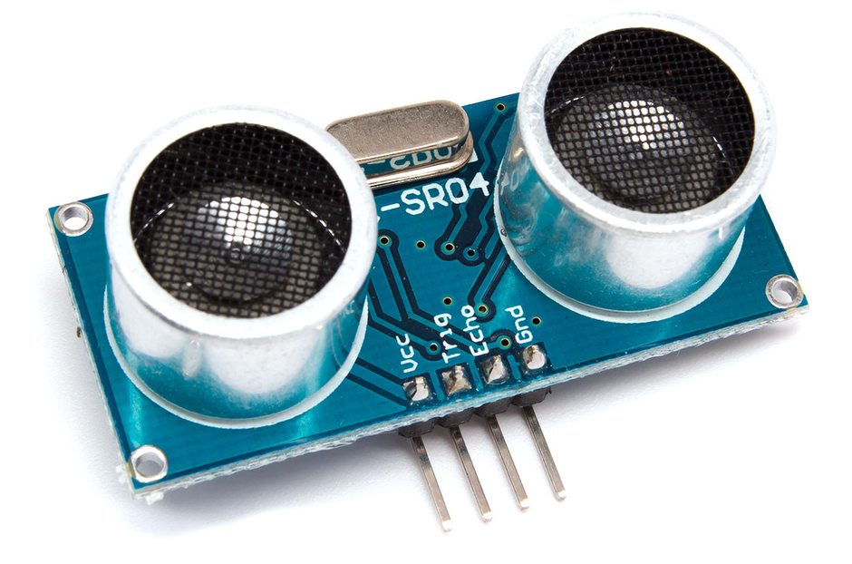

# HC-SR04
 
 
Технические характеристики HC-SR04

- Напряжение питания: +5В;
- Эффективный рабочий угол:< 15°;
- Расстояние измерений: от 2 см до 400 см;
- Разрешающая способность: 0.3 см;
- Угол измерений: 30 градусов;
- Ширина импульса триггера: 10 микросекунд;
- Размеры: 45 мм x 20 мм x 15 мм.

Пины:
- VCC: +5 вольт (постоянный ток)
- Trig : Триггер (INPUT)
- Echo: Эхо (OUTPUT)
- GND: Земля

'''java
// код на C++
int echo = 9; // echo Pin
int trig = 8; // trig Pin
void setup() { 
  Serial.begin (9600); 
  pinMode(trig, OUTPUT); 
  pinMode(echo, INPUT); 
} 
 
void loop() { 
  int duration, cm; 
  digitalWrite(trig, LOW); 
  delayMicroseconds(2); 
  digitalWrite(trig, HIGH); 
  delayMicroseconds(10); 
  digitalWrite(trig, LOW); 
  duration = pulseIn(echo, HIGH); 
  cm = duration / 58; // определение расстояния в см
  Serial.print(cm); 
  Serial.println("cm"); 
  delay(100);
}
'''

