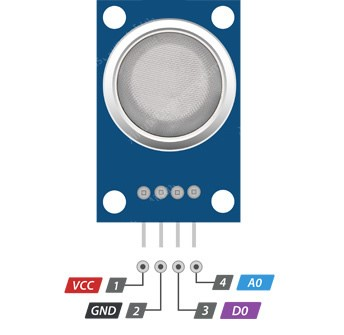
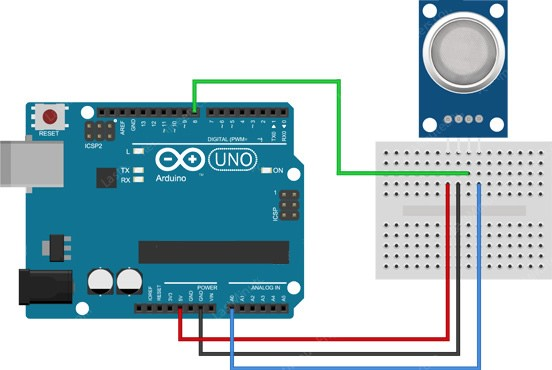

# HC-SR04
 
 
Технические характеристики MQ-5

-Входное напряжение питания: 5 В;
-Потребляемый ток: до 150 мА;
-Диапазон измерений:
 -a.	Пропан: 200–10000 ppm;
 -b.	Изобутан: 200–10000 ppm;
 -c.	Природный газ: 200–10000 ppm;
-Рабочая температура: 0 ... +50 °C;

Пины:
-VCC обеспечивает питание для модуля. Вы можете подключить его к выходу 5 В вашей платы Arduino.
-GND – вывод земли, должен быть подключен к выводу GND на Arduino.
-D0 обеспечивает цифровое представление о наличии горючих газов.
-A0 обеспечивает аналоговое выходное напряжение, пропорциональное концентрации дыма/газа.




```C++
#define MQ2pin (0)
float sensorValue;  // переменная для хранения значения датчика
void setup()
{
  Serial.begin(9600); // настроить последовательный порт на скорость 9600
  Serial.println("Gas sensor warming up!");
  delay(20000);       // дать MQ-2 время для прогрева
}
void loop()
{
  sensorValue = analogRead(MQ2pin); // прочитать аналоговый вход 0
  
  Serial.print("Sensor Value: ");
  Serial.print(sensorValue);
  
  if(sensorValue > 300)
  {
    Serial.print(" | Smoke detected!");
  }
  
  Serial.println("");
  delay(2000); // подождать 2 сек до следующего чтения
}

```

