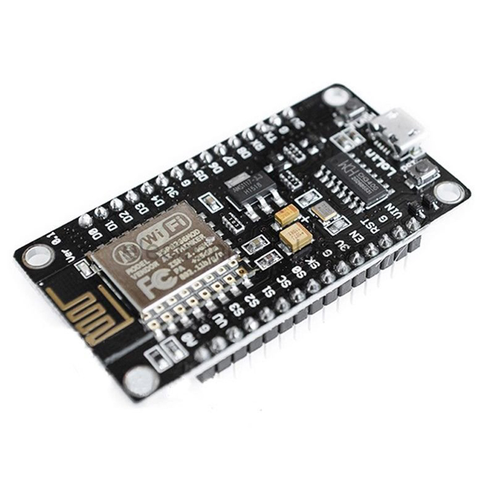

# Nodemcu firmware programmer 
 это прошивщик, которая позволяет запрограммировать ESP8266 модуль.
 
 
 
https://github.com/SpacehuhnTech/esp8266_deauther/releases

https://github.com/spacehuhn/esp8266_beaconSpam
