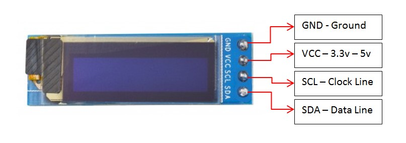

# SSD1306
 
 
Технические характеристики HC-SR04

 - драйвер IC: SSD1306,
 - интерфейс: I2C,
 - размер экрана: 0,91 дюйм,
 - разрешение 128*32,
 - напряжение поддержки 3,3 В/5 В.
 - У него 4 контакта: питание, земля и два пина, обеспечивающих связь через I2C интерфейс.

Пины:
 -	VCC	«+» Питание (входная мощность 3,3 ~ 5 В)
 -	GND	«—» Земля
 -	SDA	Линия передачи данных
 -	SCL	Часовая линия


```C++
/*
  Universal 8bit Graphics Library, https://github.com/olikraus/u8glib/
*/


#include "U8glib.h"
U8GLIB_SSD1306_128X32 u8g(U8G_I2C_OPT_NONE);	// I2C / TWI 

//#define MINI_LOGO

void drawColorBox(void)
{
  u8g_uint_t w,h;
  u8g_uint_t r, g, b;
  
  w = u8g.getWidth()/32;
  h = u8g.getHeight()/8;
  for( b = 0; b < 4; b++ )
    for( g = 0; g < 8; g++ )
      for( r = 0; r < 8; r++ )
      {
        u8g.setColorIndex((r<<5) |  (g<<2) | b );
        u8g.drawBox(g*w + b*w*8, r*h, w, h);
      }
}

void drawLogo(uint8_t d)
{
#ifdef MINI_LOGO
    u8g.setFont(u8g_font_gdr17r);
    u8g.drawStr(0+d, 22+d, "U");
    u8g.setFont(u8g_font_gdr20n);
    u8g.drawStr90(17+d,8+d,"8");
    u8g.setFont(u8g_font_gdr17r);
    u8g.drawStr(39+d,22+d,"g");
    
    u8g.drawHLine(2+d, 25+d, 34);
    u8g.drawVLine(32+d, 22+d, 12);
#else
    u8g.setFont(u8g_font_gdr25r);
    u8g.drawStr(0+d, 30+d, "U");
    u8g.setFont(u8g_font_gdr30n);
    u8g.drawStr90(23+d,10+d,"8");
    u8g.setFont(u8g_font_gdr25r);
    u8g.drawStr(53+d,30+d,"g");
    
    u8g.drawHLine(2+d, 35+d, 47);
    u8g.drawVLine(45+d, 32+d, 12);
#endif
}

void drawURL(void)
{
#ifndef MINI_LOGO
  u8g.setFont(u8g_font_4x6);
  if ( u8g.getHeight() < 59 )
  {
    u8g.drawStr(53,9,"code.google.com");
    u8g.drawStr(77,18,"/p/u8glib");
  }
  else
  {
    u8g.drawStr(1,54,"code.google.com/p/u8glib");
  }
#endif
}


void draw(void) {
  if ( u8g.getMode() == U8G_MODE_R3G3B2 ) {
    drawColorBox();
  }
  u8g.setColorIndex(1);
  if ( U8G_MODE_GET_BITS_PER_PIXEL(u8g.getMode()) > 1 ) {
    drawLogo(2);
    u8g.setColorIndex(2);
    drawLogo(1);
    u8g.setColorIndex(3);
  }
  drawLogo(0);
  drawURL();
  
}

void setup(void) {
  // flip screen, if required
  //u8g.setRot180();
}

void loop(void) {
  
  // picture loop
  u8g.firstPage();  
  do {
    draw();
  u8g.setColorIndex(1);
  } while( u8g.nextPage() );
  
  // rebuild the picture after some delay
  delay(200);  
}
```
https://www.youtube.com/watch?v=djgHV5JCNTk&ab_channel=AlexGyver
